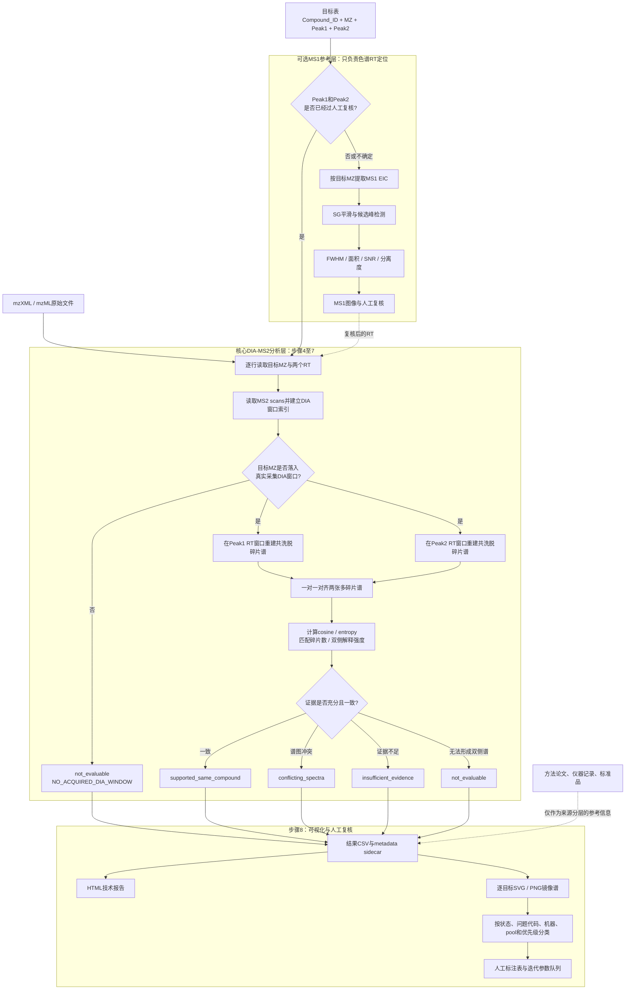

# MSAI: chiral LC-DIA-MS2 workflow

MSAI用于验证手性色谱中两个候选保留时间峰是否获得了相互一致的DIA-MS2碎片证据。

核心问题是：

> 已知目标母离子`MZ`以及候选`Peak1`、`Peak2`后，两个RT位置提取出的多碎片谱是否支持它们来自同一个化合物？

MSAI不会仅凭MS2分配R/S构型，也不会把“MS2谱相似”直接等同于已经确认的对映体。MS1或人工色谱证据、MS2同化合物证据和标准品验证始终分开记录。

## 实验层级

`IA`、`IB`、`IG`是实验机器、条件或大批次标识，每个实验下面可以包含多个pool。`GREEN`、`YELLOW`、`RED`和`CHECK`是某个实验列中的来源标签，不是机器名称。

当前IG表的一条记录可以理解为：

```text
experiment   = IG
pool         = EASMSV1P01
Compound_ID  = XS842605b
MZ           = 234.1237117
source_label = GREEN
Peak1        = 16.944 min
Peak2        = 17.385 min
```

如果未来合并IA、IB和IG，推荐转换成长表：

```text
Compound_ID | experiment | pool | source_label | MZ | Peak1 | Peak2
```

详细数据模型见[工作流与代码映射](docs/workflow_code_map.md)。

## MS1是否必须先运行？

不必先运行MSAI的自动MS1寻峰程序。核心MS2流程只要求已有目标`MZ`和需要检查的RT坐标：

```text
已有人工/标准品 Peak1、Peak2
              ↓
         直接处理MS2
```

当Peak1/Peak2缺失或不可靠时，才使用可选的MS1 EIC寻峰与人工审核流程生成RT锚点。MS1负责定位色谱峰；MS2负责判断两个RT位置是否得到一致的化合物身份支持。

## 输入

核心输入包括：

| 输入 | 用途 |
| --- | --- |
| `Compound_ID` | 跨实验、pool、重复和图像追踪化合物 |
| `MZ` | 选择真实DIA窗口并提取目标母离子/碎片轨迹 |
| `Peak1`、`Peak2` | 定义两个独立MS2提取窗口，单位默认分钟 |
| experiment / machine | 区分IA、IB、IG等实验来源 |
| pool / well | 将目标路由到正确pool原始文件 |
| mzXML或mzML | MS1/DIA-MS2原始数据 |

当前示例输入：

```text
MSAI/peaklist/merged_result_IG_EASMSV1.csv
MSAI/data/IG_STD500nM_EASMSV1_2.mzXML
```

## 工作流程

下面的流程图把“可选MS1定位”“核心MS2证据提取”和“人工复核”分成了三层。虚线表示可选输入或参考信息，不代表必须先运行MS1才能运行MS2。



图中两个RT位置各自应产生一张含有多个fragment m/z峰的MS2谱；这里的“双峰”指色谱上的`Peak1/Peak2`，不是MS2谱只能含两个碎片峰。

```text
1. 用 experiment + pool + DIA segment 匹配原始文件
2. 读取目标 Compound_ID、MZ、Peak1、Peak2
3. 可选：用MS1 EIC检查或补充RT
4. 检查目标MZ是否落入真实DIA采集窗口
5. 在Peak1和Peak2分别重建共洗脱碎片谱
6. 比较共有碎片、cosine、entropy和解释强度
7. 输出独立MS2诊断和问题代码
8. 生成HTML、SVG/PNG及人工审核目录
```

第4–8步对应代码见[workflow_code_map.md](docs/workflow_code_map.md)。

## 快速开始

在仓库根目录运行：

```powershell
python -m MSAI.python.cli.ms2 --help
```

### 1. 分析Peak1/Peak2

```powershell
python -m MSAI.python.cli.ms2 analyze `
  --peaklist MSAI\peaklist\merged_result_IG_EASMSV1.csv `
  --raw MSAI\data\IG_STD500nM_EASMSV1_2.mzXML `
  --output MSAI\results\final\ig_easmsv1\tables\ms2_analysis.csv `
  --method-profile MSAI\config\acquisition_profiles\adductmlib_chemrxiv_20260129_v1.json
```

### 2. 生成技术报告

```powershell
python -m MSAI.python.cli.ms2 report `
  --input MSAI\results\final\ig_easmsv1\tables\ms2_analysis.csv `
  --output-dir MSAI\results\final\ig_easmsv1\report
```

### 3. 生成逐目标SVG/PNG审核图

```powershell
py -3.12 -m MSAI.python.cli.ms2 export-review `
  --input MSAI\results\final\ig_easmsv1\tables\ms2_analysis.csv `
  --output-dir MSAI\results\final\ig_easmsv1\spectrum_review `
  --method-profile MSAI\config\acquisition_profiles\adductmlib_chemrxiv_20260129_v1.json `
  --source-machine-label-column IG
```

旧入口`get_chiral_frag.py`、`ms2_review_report.py`和`export_ms2_spectrum_review.py`仍然可用，但新代码统一使用`python -m MSAI.python.cli.ms2`。

## 如何理解MS2状态

| `ms2_diagnostic_status` | 含义 |
| --- | --- |
| `supported_same_compound` | 两个RT位置的碎片证据支持同一化合物 |
| `conflicting_spectra` | 两侧都有足够证据，但谱图明显冲突 |
| `insufficient_evidence` | 有谱但匹配碎片或解释强度不足 |
| `not_evaluable` | DIA未覆盖、目标信号为空或至少一侧无法形成谱 |
| `not_attempted` | 没有两个可用RT坐标，因此未进行双侧比较 |

这些状态不应被重新命名为“确认对映体”。较强候选至少需要：

```text
可信的双峰色谱证据
        +
supported_same_compound
        +
标准品或其他正交验证
```

诊断顺序和当前保守阈值见[MS2诊断标准](docs/ms2_diagnostic_standard.md)。这些阈值是筛选guardrail，尚不是经过独立真值集验证的通用阈值。

## 当前EASMSV1数据状态

当前正式分析共525条记录：

| 状态 | 数量 |
| --- | ---: |
| `supported_same_compound` | 21 |
| `conflicting_spectra` | 4 |
| `insufficient_evidence` | 28 |
| `not_evaluable` | 351 |
| `not_attempted` | 121 |

当前只导入了`IG_STD500nM_EASMSV1_2.mzXML`。其真实DIA覆盖约为`m/z 367.5–564.5`；351条不可评价记录中有306条不在这份文件的采集范围内。它们应解释为“当前导入文件未覆盖”，而不是谱图匹配失败。应优先确认是否存在对应的`_1`、`_3`质量区段文件。

采集参数差异见[acquisition_parameter_reconciliation.md](docs/acquisition_parameter_reconciliation.md)，人工图像观察见[ms2_visual_audit_EASMSV1.md](docs/ms2_visual_audit_EASMSV1.md)。

## 结果目录

```text
MSAI/results/
├── final/ig_easmsv1/
│   ├── tables/             # 正式CSV和metadata sidecar
│   ├── report/             # HTML报告和人工审核队列
│   └── spectrum_review/    # 逐目标SVG/PNG及分类视图
├── development/ms2/        # 参数扫描、shadow和旧版结果
└── reference/ms1/          # 可选MS1校准及人工审核产物
```

只有`final/ig_easmsv1/`是当前正式MS2交付目录。详情见[results/README.md](results/README.md)。

## 代码结构

```text
MSAI/
├── python/
│   ├── cli/ms2.py      # analyze / report / export-review统一入口
│   ├── ms2/            # 第4–7步核心代码
│   │   ├── raw_io.py
│   │   ├── raw_metadata.py
│   │   ├── indexing.py
│   │   ├── chromatograms.py
│   │   ├── extraction.py
│   │   ├── similarity.py
│   │   ├── diagnostics.py
│   │   └── pipeline.py
│   ├── ms2_review/     # 第8步报告和图像
│   └── ms1_review/     # 可选MS1参考流程
├── config/             # 方法参数与shadow profiles
└── standards/          # 版本化诊断及人工审核规则
```

代码导航见[python/README.md](python/README.md)。`ms2_core.py`以及原根目录模块是向后兼容facade，新实现不应继续堆入这些文件。

## 参数与科学边界

当前兼容默认值包括10 ppm EIC窗口、8秒RT半窗口、碎片共洗脱相关性大于0.9、0.01 Da谱图对齐、cosine不低于0.7、至少6个匹配碎片以及两侧至少50%解释强度。

这些参数不能通过降低阈值来弥补：

- 未采集的DIA质量范围；
- 错误的加合离子或目标m/z；
- 错误的Peak1/Peak2；
- 固定碰撞能没有产生的碎片；
- DIA共隔离造成的复杂背景。

参数开发、MS1 FWHM/SNR/面积/分离度、批处理、E-ASMS效应量和BH多重检验的完整说明已移至[扩展开发参考](docs/extended_development_reference.md)。

## 测试

```powershell
py -3.12 -m pytest -q tests
```

代码提交前同时运行固定版本的格式、静态规则和类型检查：

```powershell
uvx ruff@0.14.14 format --check MSAI/python tests
uvx ruff@0.14.14 check MSAI/python tests
uvx --with pillow pyright@1.1.408
```

`uvx`会把开发工具放在隔离缓存中，不会污染项目运行环境。Ruff配置位于仓库根目录
`pyproject.toml`，Pyright配置位于`pyrightconfig.json`；两者都检查核心代码和测试。
核心mzXML/mzML读取不强制依赖`pyopenms`，PNG导出需要Pillow。

## 主要文档

- [工作流与代码映射](docs/workflow_code_map.md)
- [MS2诊断标准](docs/ms2_diagnostic_standard.md)
- [MS2静态审核方案](docs/ms2_static_visual_review_plan.md)
- [EASMSV1 MS2图像审计](docs/ms2_visual_audit_EASMSV1.md)
- [采集参数来源与冲突](docs/acquisition_parameter_reconciliation.md)
- [MS1参考标准](docs/ms1_reference_standard.md)
- [MS1参数审计](docs/ms1_parameter_audit_EASMSV1.md)
- [扩展开发与验证参考](docs/extended_development_reference.md)

本分支为Python-only实现，不再包含R包接口。
