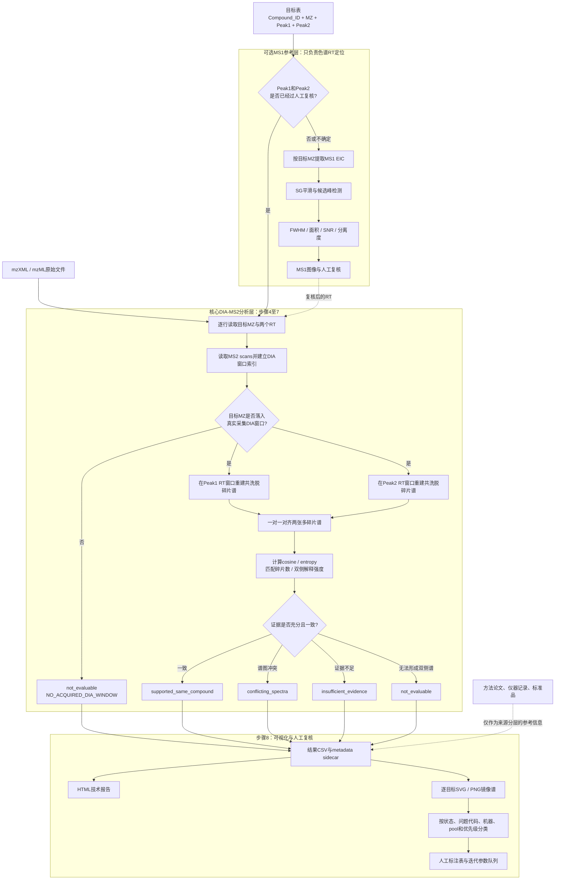

# MSAI: chiral LC-DIA-MS2 workflow

MSAI用于验证手性色谱中两个候选保留时间峰是否获得了相互一致的DIA-MS2碎片证据。

核心问题是：

> 已知目标母离子`MZ`以及候选`Peak1`、`Peak2`后，两个RT位置提取出的多碎片谱是否支持它们来自同一个化合物？

MSAI不会仅凭MS2分配R/S构型，也不会把“MS2谱相似”直接等同于已经确认的对映体。MS1或人工色谱证据、MS2同化合物证据和标准品验证始终分开记录。

## 实验层级

`IA`、`IB`、`IG`是实验机器、条件或大批次标识，每个实验下面可以包含多个pool。`GREEN`、`YELLOW`、`RED`和`CHECK`是某个实验列中的来源标签，不是机器名称。

当前IG表的一条记录可以理解为：

```text
experiment   = IG
pool         = EASMSV1P01
Compound_ID  = XS842605b
MZ           = 234.1237117
source_label = GREEN
Peak1        = 16.944 min
Peak2        = 17.385 min
```

如果未来合并IA、IB和IG，推荐转换成长表：

```text
Compound_ID | experiment | pool | source_label | MZ | Peak1 | Peak2
```

详细数据模型见[工作流与代码映射](MSAI/docs/workflow_code_map.md)。

## MS1是否必须先运行？

不必先运行MSAI的自动MS1寻峰程序。核心MS2流程只要求已有目标`MZ`和需要检查的RT坐标：

```text
已有人工/标准品 Peak1、Peak2
              ↓
         直接处理MS2
```

当Peak1/Peak2缺失或不可靠时，才使用可选的MS1 EIC寻峰与人工审核流程生成RT锚点。MS1负责定位色谱峰；MS2负责判断两个RT位置是否得到一致的化合物身份支持。

## 输入

核心输入包括：

| 输入 | 用途 |
| --- | --- |
| `Compound_ID` | 跨实验、pool、重复和图像追踪化合物 |
| `MZ` | 选择真实DIA窗口并提取目标母离子/碎片轨迹 |
| `Peak1`、`Peak2` | 定义两个独立MS2提取窗口，单位默认分钟 |
| experiment / machine | 区分IA、IB、IG等实验来源 |
| pool / well | 将目标路由到正确pool原始文件 |
| mzXML或mzML | MS1/DIA-MS2原始数据 |

当前示例输入：

```text
MSAI/peaklist/merged_result_IG_EASMSV1.csv
MSAI/data/IG_STD500nM_EASMSV1_2.mzXML
```

## 工作流程

下面的流程图把“可选MS1定位”“核心MS2证据提取”和“人工复核”分成了三层。虚线表示可选输入或参考信息，不代表必须先运行MS1才能运行MS2。



图中两个RT位置各自应产生一张含有多个fragment m/z峰的MS2谱；这里的“双峰”指色谱上的`Peak1/Peak2`，不是MS2谱只能含两个碎片峰。

```text
1. 用 experiment + pool + DIA segment 匹配原始文件
2. 读取目标 Compound_ID、MZ、Peak1、Peak2
3. 可选：用MS1 EIC检查或补充RT
4. 检查目标MZ是否落入真实DIA采集窗口
5. 在Peak1和Peak2分别重建共洗脱碎片谱
6. 比较共有碎片、cosine、entropy和解释强度
7. 输出独立MS2诊断和问题代码
8. 生成HTML、SVG/PNG及人工审核目录
```

第4–8步对应代码见[workflow_code_map.md](MSAI/docs/workflow_code_map.md)。

## 快速开始

在仓库根目录运行：

```powershell
python -m MSAI.python.cli.ms2 --help
```

### 1. 分析Peak1/Peak2

```powershell
python -m MSAI.python.cli.ms2 analyze `
  --peaklist MSAI\peaklist\merged_result_IG_EASMSV1.csv `
  --raw MSAI\data\IG_STD500nM_EASMSV1_2.mzXML `
  --output MSAI\results\final\ig_easmsv1\tables\ms2_analysis.csv `
  --method-profile MSAI\config\acquisition_profiles\adductmlib_chemrxiv_20260129_v1.json
```

### 2. 生成技术报告

```powershell
python -m MSAI.python.cli.ms2 report `
  --input MSAI\results\final\ig_easmsv1\tables\ms2_analysis.csv `
  --output-dir MSAI\results\final\ig_easmsv1\report
```

### 3. 生成逐目标SVG/PNG审核图

```powershell
py -3.12 -m MSAI.python.cli.ms2 export-review `
  --input MSAI\results\final\ig_easmsv1\tables\ms2_analysis.csv `
  --output-dir MSAI\results\final\ig_easmsv1\spectrum_review `
  --method-profile MSAI\config\acquisition_profiles\adductmlib_chemrxiv_20260129_v1.json `
  --source-machine-label-column IG
```

旧入口`get_chiral_frag.py`、`ms2_review_report.py`和`export_ms2_spectrum_review.py`仍然可用，但新代码统一使用`python -m MSAI.python.cli.ms2`。

### 4. ML shadow（需要独立truth后才能训练）

训练数据必须包含精确truth label、`Compound_ID`和独立`batch_id`，并预先
指定一个完全锁定的最终批次：

```powershell
python -m MSAI.python.cli.ms2 train-shadow `
  --input independent_ms2_truth.csv `
  --source-sidecar independent_ms2_truth.sources.json `
  --locked-final-batch BATCH-FINAL `
  --output MSAI\results\development\ms2\shadow\model.json
```

`--source-sidecar`在多batch训练时是逐batch来源manifest，而不是任选一个
run的metadata。每个eligible `batch_id`必须映射到生成该批谱图的sidecar；
相对路径以manifest所在目录为基准，可选SHA-256用于锁定文件内容：

```json
{
  "batch_sources": {
    "BATCH-A": {"path": "BATCH-A.csv.metadata.json", "sha256": "<64 hex>"},
    "BATCH-B": {"path": "BATCH-B.csv.metadata.json", "sha256": "<64 hex>"},
    "BATCH-C": {"path": "BATCH-C.csv.metadata.json", "sha256": "<64 hex>"},
    "BATCH-FINAL": {"path": "BATCH-FINAL.csv.metadata.json", "sha256": "<64 hex>"}
  }
}
```

训练会逐batch验证相同的冻结提取合同，并在artifact中只记录路径和hash，
不会复制或改写Method/提取参数。缺失、额外、hash不符或参数不一致的batch
都会fail closed。

训练产物不会替换v2。推理只在原CSV后追加五个`ml_*`字段，再单独导出
所有v2/ML分歧：

```powershell
python -m MSAI.python.cli.ms2 apply-shadow `
  --input MSAI\results\final\ig_easmsv1\tables\ms2_analysis.csv `
  --model MSAI\results\development\ms2\shadow\model.json `
  --output MSAI\results\development\ms2\shadow\ms2_shadow.csv

python -m MSAI.python.cli.ms2 shadow-review `
  --input MSAI\results\development\ms2\shadow\ms2_shadow.csv `
  --model MSAI\results\development\ms2\shadow\model.json `
  --output-dir MSAI\results\development\ms2\shadow\review

python -m MSAI.python.cli.ms2 package-shadow-review `
  --input MSAI\results\development\ms2\shadow\ms2_shadow.csv `
  --review-dir MSAI\results\development\ms2\shadow\review `
  --model MSAI\results\development\ms2\shadow\model.json `
  --output share\MS2_shadow_manual_review.zip
```

当前129行coverage slice没有独立truth，三步都必须省略`--model`：

```powershell
python -m MSAI.python.cli.ms2 apply-shadow `
  --input MSAI\results\final\ig_easmsv1\tables\ms2_analysis.csv `
  --output MSAI\results\development\ms2\shadow\ms2_shadow_untrained.csv

python -m MSAI.python.cli.ms2 shadow-review `
  --input MSAI\results\development\ms2\shadow\ms2_shadow_untrained.csv `
  --output-dir MSAI\results\development\ms2\shadow\review_untrained

python -m MSAI.python.cli.ms2 package-shadow-review `
  --input MSAI\results\development\ms2\shadow\ms2_shadow_untrained.csv `
  --review-dir MSAI\results\development\ms2\shadow\review_untrained `
  --output share\MS2_RT10_UNTRAINED_manual_review.zip
```

`package-shadow-review`只收入最终CSV及其metadata、人工复核队列/标注表、
`START_HERE.html`和其中引用的canonical PNG/SVG。命令会验证result/review
hash、行数、model ID、sidecar派生的渲染上下文、PNG像素、SVG内容、图片
manifest、HTML本地链接和ZIP CRC；不会收入重复的`views/`、galleries、代码或
中间训练文件。默认输出到`share/`，已有文件需
显式加`--force`才会替换。没有独立truth时，包内README会明确标为
`UNTRAINED feasibility`，不会把当前经验阈值称为best/tuned参数。对已训练
结果必须同时提供`--model`；命令验证artifact的ID、SHA和实际选定参数，但
不会把模型文件收入人工审核包。

当前129行coverage slice没有独立truth且只有一个raw/batch，只允许运行上述
无模型的feasibility链路；不得据此拟合或声称验证性能。
完整边界与计划见[MS2 shadow classifier plan](MSAI/docs/ms2_shadow_classifier_plan.md)。

## 如何理解MS2状态

| `ms2_diagnostic_status` | 含义 |
| --- | --- |
| `supported_same_compound` | 两个RT位置的碎片证据支持同一化合物 |
| `conflicting_spectra` | 两侧都有足够证据，但谱图明显冲突 |
| `insufficient_evidence` | 有谱但匹配碎片或解释强度不足 |
| `not_evaluable` | DIA未覆盖、目标信号为空或至少一侧无法形成谱 |
| `not_attempted` | 没有两个可用RT坐标，因此未进行双侧比较 |

这些状态不应被重新命名为“确认对映体”。较强候选至少需要：

```text
可信的双峰色谱证据
        +
supported_same_compound
        +
标准品或其他正交验证
```

诊断顺序和当前保守阈值见[MS2诊断标准](MSAI/docs/ms2_diagnostic_standard.md)。这些阈值是筛选guardrail，尚不是经过独立真值集验证的通用阈值。

## 当前EASMSV1数据状态

当前正式分析共525条记录：

| 状态 | 数量 |
| --- | ---: |
| `supported_same_compound` | 21 |
| `conflicting_spectra` | 4 |
| `insufficient_evidence` | 28 |
| `not_evaluable` | 351 |
| `not_attempted` | 121 |

当前只导入了`IG_STD500nM_EASMSV1_2.mzXML`。其真实DIA覆盖约为`m/z 367.5–564.5`；351条不可评价记录中有306条不在这份文件的采集范围内。它们应解释为“当前导入文件未覆盖”，而不是谱图匹配失败。应优先确认是否存在对应的`_1`、`_3`质量区段文件。

采集参数差异见[acquisition_parameter_reconciliation.md](MSAI/docs/acquisition_parameter_reconciliation.md)，人工图像观察见[ms2_visual_audit_EASMSV1.md](MSAI/docs/ms2_visual_audit_EASMSV1.md)。

## 结果目录

```text
MSAI/results/
├── final/ig_easmsv1/
│   ├── tables/             # 正式CSV和metadata sidecar
│   ├── report/             # HTML报告和人工审核队列
│   └── spectrum_review/    # 逐目标SVG/PNG及分类视图
├── development/ms2/        # 参数扫描、shadow和旧版结果
└── reference/ms1/          # 可选MS1校准及人工审核产物
```

只有`final/ig_easmsv1/`是当前正式MS2交付目录。详情见[results/README.md](results/README.md)。

## 代码结构

```text
MSAI/
├── python/
│   ├── cli/ms2.py      # 分析、复核及ML shadow统一入口
│   ├── ms2/            # 第4–7步核心代码
│   │   ├── raw_io.py
│   │   ├── raw_metadata.py
│   │   ├── indexing.py
│   │   ├── chromatograms.py
│   │   ├── extraction.py
│   │   ├── similarity.py
│   │   ├── diagnostics.py
│   │   └── pipeline.py
│   ├── ms2_review/     # 第8步报告和图像
│   ├── ms2_ml/         # 独立truth训练、abstention及shadow输出
│   └── ms1_review/     # 可选MS1参考流程
├── config/             # 方法参数与shadow profiles
└── standards/          # 版本化诊断及人工审核规则
```

代码导航见[python/README.md](python/README.md)。`ms2_core.py`以及原根目录模块是向后兼容facade，新实现不应继续堆入这些文件。

## 参数与科学边界

本项目将参数来源分为六类，避免把工程默认值误写成论文标准：

- **论文Method**：来自Wang等人的*Orthogonal molecular annotation in mass spectrometry with AdductMLib*（[ChemRxiv DOI: 10.26434/chemrxiv.10001689/v1](https://doi.org/10.26434/chemrxiv.10001689/v1)）；
- **raw实测**：直接读取当前mzXML/mzML中的隔离窗口、碰撞能等采集元数据；
- **legacy兼容**：继承早期`GetFrag`/手性双峰流程以保持结果可比较，不代表论文推荐值；
- **外部经验值**：借用其他工作流的常见默认值，但尚未在本方法上完成校准；
- **项目经验值**：为降低偶然匹配或保持保守筛选而设置，暂无外部出处；
- **实验性shadow值**：只用于敏感性分析和人工审核，不能静默替换主流程。

论文Method第17页“Data extraction and preprocessing”（正文行335–350）明确给出：固定DIA隔离窗口为`4.5 Da`、每个样品采集三个DIA文件、前体–碎片RT对齐为`±10 seconds`、最低色谱相关性为`0.9`，并要求加合物对`Pearson r > 0.90`且RT差小于10秒。第16页正文行325–329另写DIA窗口为`5 m/z`且重叠`1 m/z`，与第17页的`4.5 Da`存在原文内部差异；仓库保留两项记录，不自行猜测合并。机器可读摘录见[参考方法profile](MSAI/config/acquisition_profiles/adductmlib_chemrxiv_20260129_v1.json)，详细核对见[采集参数来源与冲突](MSAI/docs/acquisition_parameter_reconciliation.md)。

下表覆盖当前主流程中会改变MS2提取、谱图比较或自动分类的科学参数；I/O列名、输出路径和`--no-metadata`等非科学选项不列入。

| 环节 | 参数 | 当前主流程值 | 参考来源 | 状态与后续处理 |
| --- | --- | ---: | --- | --- |
| RT窗口 | `rt_half_window_sec` | `10 s` | **论文Method第17页正文行337–339规定`±10 s`** | 当前主流程已与论文一致；`8 s`仅保留为历史比较值，变更后结果必须重新生成和审核 |
| 近峰防重叠 | `half_width=min(configured, 0.4*RT separation)` | `0.4` | 项目工程规则，论文未给出 | 保留两个窗口间20%空隙；属于经验性超参数，需用近距离双峰真值调整 |
| EIC质量窗口 | `mz_tol`及未单独指定时的precursor/fragment EIC tolerance | `10 ppm` | 手性提取兼容默认值，论文Method未给出EIC tolerance | 论文正文中的`5 ppm`用于候选结构检索，不是MS2 EIC提取参数；本值需结合仪器质量误差和真值集校准 |
| EIC独立容差 | `precursor_eic_mz_tol`、`fragment_eic_mz_tol` | 默认继承`10 ppm` | 项目为区分前体提取与fragment EIC/centroid合并而新增 | 可分别校准；作者笔记中的`3 ppm`不在论文PDF Method中且适用范围未确认，只能做shadow比较 |
| DIA窗口 | raw isolation bounds；缺失时`dia_iso_win` fallback | raw优先；fallback `15 m/z` | raw实测优先；当前raw报告`15 m/z`。论文第16页为`5 m/z + 1 m/z overlap`，第17页为`4.5 Da` | `15`只可描述为当前raw/fallback行为，不能描述为论文Method；复现论文时需先解决论文内部差异 |
| fragment候选范围 | `fragment_mz < precursor_mz - 10 Da` | `10 Da`质量差 | legacy兼容规则，论文未给出 | 项目经验性过滤，应在不同前体质量和碎裂类型上复核 |
| fragment绝对强度 | `min_fragment_intensity` | `2000` | legacy `GetFrag`兼容阈值；论文未给出 | 未经独立真值验证，需按噪声水平、批次和仪器响应校准 |
| fragment相对强度 | `min_fragment_relative_intensity` | `0.0` | 项目默认值 | 当前重建阶段不追加相对强度过滤；可作为方法开发参数调整 |
| 共洗脱相关性 | `min_fragment_correlation` | 严格`Pearson r > 0.9` | **论文Method第17页正文行338–339及346–348** | 论文直接支持；当前代码与论文一致 |
| 相关性算法 | `fragment_correlation_mode` | `full_window` | legacy兼容的整窗Pearson；论文只给阈值，未规定共同零值处理 | 主流程兼容值；应报告算法实现，不能仅报告`0.9` |
| active-support相关性 | relative support / minimum scans / apex offset / consecutive scans | `0.05 / 5 / 1 / 3` | EASMSV1可视审计后设置的实验性shadow值，论文未给出 | 默认`full_window`模式下不生效；没有盲法标签前不得升级为主标准 |
| 候选谱合并 | `consensus_scans` | `1` | legacy兼容值，论文未给出 | 经验性超参数；应比较多扫描共识谱的稳定性 |
| 比较前低强度过滤 | `min_relative_intensity` | 基峰的`1%` | 项目经验性默认值，论文未给出 | 用于减少低强度偶然匹配；需做阈值敏感性分析 |
| fragment谱图对齐 | `fragment_mz_tol` | `0.01 Da` | 项目工程默认值，论文未给出 | 未由论文或独立真值集验证；应依据实测fragment质量误差分布调整 |
| cosine强度变换 | `intensity_power` | `0.5`（平方根） | 项目谱图比较实现，论文未给出 | 降低单一base peak支配；需和不变换或其他变换进行验证 |
| cosine阈值 | `min_cosine` | `0.7` | 借用[GNPS molecular networking](https://ccms-ucsd.github.io/GNPSDocumentation/networking/)常见默认值；AdductMLib论文未给出 | 外部经验性超参数，不是本方法已验证标准；需用独立阳性/阴性谱图校准 |
| 最少匹配碎片 | `min_matched_peaks` | `6` | 同样借用GNPS常见默认值；AdductMLib论文未给出 | 防止少量匹配产生虚高cosine，但可能排除稀疏真阳性；需按化合物类别校准 |
| 双侧解释强度 | `min_explained_intensity` | 每侧`50%` | 项目保守guardrail，论文和GNPS默认规则均未给出 | 项目经验性超参数；用于避免匹配只覆盖低强度碎片，需用独立真值集调整 |
| entropy阈值 | `min_entropy_similarity` | `None`（关闭） | 项目保守选择，论文未给出 | 当前只报告entropy，不参与pass/fail；校准完成前保持关闭 |
| ML threshold搜索空间 | cosine `0.50–0.95`（步长`0.025`）；匹配碎片`2/3/4/5/6/8/10`；解释强度`0.3–0.8`（步长`0.1`）；entropy关闭或`0.5/0.6/0.7/0.75/0.8/0.85/0.9` | 共`6,384`组 | 项目预先设定的经验搜索空间，论文未给出 | 只允许在独立truth的nested grouped CV中选择；不是论文Method，也不能用当前129行结果反推 |
| ML错误率约束 | `specificity_target`；低概率conflict端的positive safety | 最低`0.95` | 项目预先设定的保守错误率目标，论文未给出 | 训练接口不得调低到`0.95`以下；主目标是在held-out specificity满足约束时最大化recall |
| Logistic候选 | population `StandardScaler` + L2 Logistic；`C=1e-4…1e2`按10倍递增；`class_weight=None/balanced` | `7 × 2`组 | 标准可解释baseline与项目预设工程网格，论文未给出 | 不允许L1、树、interaction或NN；threshold在平局及跨batch改善不稳定时优先 |
| Logistic数值求解 | deterministic Newton/IRLS；`max_iter=200`；`tolerance=1e-9`；最多40次step-halving；充分下降常数`1e-4` | 固定 | 数值工程默认值，论文未给出，也不是科学Method参数 | 不进入超参数搜索；14组逐一记录尝试、收敛和失败情况，outer/final refit未收敛则终止，deployment只接受`converged=true`且1–200次迭代的artifact |
| 概率与不确定性报告 | Laplace bucket平滑`(+1)/(+2)`；10个等宽calibration bins；按`Compound_ID` group bootstrap `1,000`次、95% CI；base seed `20260129` | 固定工程默认 | 项目为稳定概率报告与可重复性预设，论文未给出 | CI分别覆盖all-row call、全概率质量、non-abstained selective performance、status与coverage；artifact记录实际seed、派生seed和成功bootstrap次数，样本不足时不得宣称验证性能 |
| ML复核提示 | `NEAR_ML_DECISION_BOUNDARY`距离任一概率边界不超过`0.05` | `0.05` | 项目人工复核heuristic，论文未给出 | 只增加review flag，不改变模型概率或四类ML status；后续可随审核资源单独调整 |

因此，当前自动分类只能称为**包含论文约束的项目筛选流程**，不能整体称为“论文已经验证的诊断标准”。论文有明确出处的参数应按原文实现；论文未定义的参数必须在结果metadata中记录实际值，并明确标注为兼容值、经验性超参数或实验性shadow值。后续调整应使用authentic same-compound阳性、近等质量/共洗脱干扰阴性，按compound和batch分组建立独立验证集，再预先指定错误率目标进行校准；不能根据当前输出反向挑选看起来更好的阈值。

ML model-family的source contract采用closed-world校验：metadata的analysis parameters只能包含25个已冻结输入生成键，以及成组出现的4个下游decision guardrail（`min_cosine`、`min_matched_peaks`、`min_explained_intensity`、`min_entropy_similarity`）。未知新键、只出现部分guardrail、或`parameters`与`provenance_layers.analysis_parameters`不一致都会失败；新增提取参数必须先显式更新并版本化contract。

这些参数不能通过降低阈值来弥补：

- 未采集的DIA质量范围；
- 错误的加合离子或目标m/z；
- 错误的Peak1/Peak2；
- 固定碰撞能没有产生的碎片；
- DIA共隔离造成的复杂背景。

参数开发、MS1 FWHM/SNR/面积/分离度、批处理、E-ASMS效应量和BH多重检验的完整说明已移至[扩展开发参考](MSAI/docs/extended_development_reference.md)。当前版本化规则及未来校准要求见[MS2诊断标准](MSAI/docs/ms2_diagnostic_standard.md)。

## 测试

```powershell
py -3.12 -m pytest -q tests
```

代码提交前同时运行固定版本的格式、静态规则和类型检查：

```powershell
uvx ruff@0.14.14 format --check MSAI/python tests
uvx ruff@0.14.14 check MSAI/python tests
uvx --with pillow pyright@1.1.408
```

`uvx`会把开发工具放在隔离缓存中，不会污染项目运行环境。Ruff配置位于仓库根目录
`pyproject.toml`，Pyright配置位于`pyrightconfig.json`；两者都检查核心代码和测试。
核心mzXML/mzML读取不强制依赖`pyopenms`；`shadow-review`的PNG导出及
`package-shadow-review`的PNG逐像素完整性复核需要Pillow。

## 主要文档

- [工作流与代码映射](MSAI/docs/workflow_code_map.md)
- [MS2诊断标准](MSAI/docs/ms2_diagnostic_standard.md)
- [MS2静态审核方案](MSAI/docs/ms2_static_visual_review_plan.md)
- [EASMSV1 MS2图像审计](MSAI/docs/ms2_visual_audit_EASMSV1.md)
- [采集参数来源与冲突](MSAI/docs/acquisition_parameter_reconciliation.md)
- [MS1参考标准](MSAI/docs/ms1_reference_standard.md)
- [MS1参数审计](MSAI/docs/ms1_parameter_audit_EASMSV1.md)
- [扩展开发与验证参考](MSAI/docs/extended_development_reference.md)

本分支为Python-only实现，不再包含R包接口。
